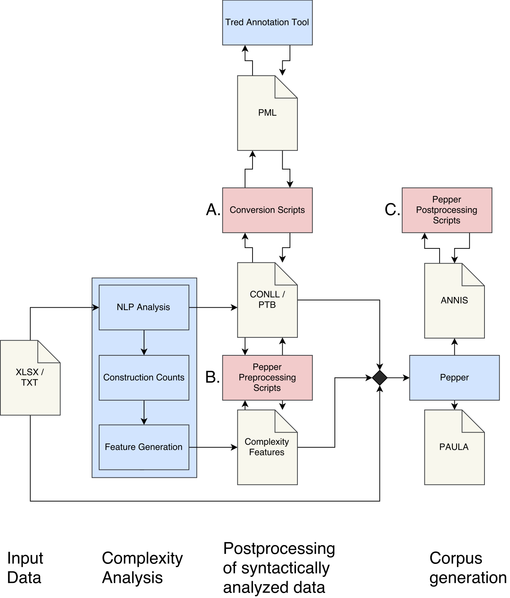

# README

This project contains all automatic components of the LangBank processing workflow for 
Early New High German (ENHG) data, that were used to generate the syntactically analyzed 
LangBank subset included in the Ridges Herbology corpus 7.0 data release 
(<https://www.linguistik.hu-berlin.de/de/institut/professuren/korpuslinguistik/forschung/ridges-projekt/>), and which are not stand-alone 3rd party tools. This 
includes 

a. the conversion pipeline for parses from and to the PML format, 
b. a series of pepper (<http://corpus-tools.org/pepper/>) conversion preprocessing scripts, and 
c. a pepper postprocessing conversion script.

While each of these components are tailord to suit the requirements of the LangBank 
project, all ressources may be used as they are or in parts or consulted as schemas for 
own modifications under the Apache 2.0 license.

If you are not familiar with the LangBank workflow for Early New High German data, or 
searching for pointers to its 3rd party components, please take a look at Section IV.

If you have any questions or comments feel free to contact us at 
<langbank@sfs.uni-tuebingen.de>. 

For more information on the LangBank research project, please see 
<http://sfs.uni-tuebingen.de/langbank/index.html>.

## I. Project Structure

This project contains three folders:

1. **LangBankConverter** contains all conversion scripts.

2. **Lib** is the library folder containing various external resources that are referenced in the conversion pipeline. 

3. **Demos** contains materials for the demo runs. Each demo has the same internal structure. **./Demos/.../in/** contains required input data. **./Demos/.../out/** contains the output produced by the last demo run. Since **./Demos/.../out/** is cleared and re-created with every demo run, **./Demos/.../expected-output/** contains the expected output that should be generated by the system if everything works as expected given the provided input data is used.

## II. Project Usage

### A. Format Conversion Pipeline

The **tred_converter.py** script performs conversion from and to PML dependencies and 
constituencies, i.e. it is the access point for the conversion pipeline. It is a wrapper 
for running the respective Tred scripts included in this project recursively using the 
configurations specified for the LangBank project. It also incorporates some automized 
pre- and postprocessing to fit the expected input/output (parses from Berkeley or the Mate 
tools).

To run the script, enter the **LangBankConverter** directory in your terminal and run

	> python3 tred_converter.py MODE INDIR OUTDIR DERIVE_PTB USE_VROOT

Note that

* Valid **MODE**s are either **from** or **to** (PML format). 
* **INDIR** and **OUTDIR** specifiy the input and output directory (not files!). 
* **DERIVE_PTB** only applies in the **to** mode if the input directory contains conll 
dependency parses. In this case, it derives PTB parses from conll parses before starting 
conversion. For this, we use the Berkeley Parser 1.7 
(<https://github.com/slavpetrov/berkeleyparser>), for which we wrote a simple wrapper to 
improve conversion performance, see **./Lib/java/BerkeleyConnl2Ptb.jar**. 
* **USE_VROOT** again only applies in the **to** mode and introduces virtual roots, which 
facilitates changes at the root level in Tred. 

For more details on potential values for each of these parameters, run 

	> python3 tred_converter.py 

without any parameters. This prompts the help message.

For a demo run, make sure your project includes the **Demo** folder and run

	> python3 tred_converter.py MODE demo

In the demo mode, no input or output directory is required, but users have to specifiy the 
conversion mode (**to** or **from** PML format).

### B. Pepper Preprocessing

In the LangBank project, all parses are generated while computing various indices of 
language complexity. This complexity analysis is computed by an analysis pipeline, that is currently being implemented to the freely available CTAP system and which will be available at <http://www.ctapweb.com/> by the end of 2017. The parses as well as the complexity measures outputted by the complexity analysis system require some processing, befor they may be merged with the original Ridges excel file in Pepper. 

The script **tree_formatter.py** removes zero decimal digits from the parses. This is only 
necessary, when calculating complexity measures based on data encoded in xlsx format, because in this case integers are read as doubles by the system. If you use the complexity analysis system on xlsx data and your texts may contain integers, enter the **LangBankConverter** directory in your terminal and run

	> python3 tree_formatter.py INDIR OUTDIR
	
where **INDIR** and **OUTDIR** are replaced with the input and output directory for your 
conll dependency and/or PTB constituency parses. 

The script **annis_meta_info_adjuster.py** simplifies the nomenclature of the complexity 
measures, that are provided by the complexity analysis system in attribute value format 
for each document. It also removes measures that only differ by means of their 
normalization and introduces namespaces, which is necessary to sort the complexity 
measures, which are provided as document meta data. To execute the script, enter the 
**LangBankConverter** directory in your terminal and run

	> python3 tree_formatter.py INDIR OUTDIR

where **INDIR** and **OUTDIR** are replaced with the input and output directory for your 
meta information files. 

### C. Pepper Postprocessing

After merging all annotations using Pepper and exporting the resulting multi-layer corpus 
to ANNIS, some final postprocessing is performed to finalize the LangBank data. This 
includes adding a predefined list of query examples and an advanced visualization of the 
annotated data that facilitates reading texts in ANNIS as well as arranging annotations 
layers in meaningful groups and ensuring that they are all properly visualized. To execute 
the script, enter the **LangBankConverter** directory in your terminal and run

	> python3 annis_postprocessor.py TEMPLATE_DIR INDIR (OUTDIR)

Note that

* **TEMPLATE_DIR** has to be replaced with a directory containing i) predefined query terms in a file called **example_queries.annis**; ii) a folder **ExtData** containing the visualization layers for reading support. In order to use the templates employed in the LangBank data, use the folder **./Lib/rsrc/** in this project. If you want to generate your own templates, you may want to consult the ANNIS 3 documentation.
* As before, **INDIR** should be replaced with the input directory.
* **OUTDIR** should be replaced with the output directory. Note that **OUTDIR** is an optional parameter in this script. If no output directory is provided, the script will modify the data within the input directory.

## III. Project Prerequisites

All scripts are written in Python3. Hence, an appropriate python installation is mandatory 
to execute any of the conversion scripts provided in the folder **LangBankConverter**. 

Furthermore, in order to derive PTB parses from conll parses in **tred_converter.py**, a 
Java (1.8+) installation is necessary. 

Finally, the workflow is designed to run on UNIX systems and may not work (as expected) on 
other platforms such as Microsoft Windows without further adjustments.

## IV. Project Background

The LangBank project is dedicated to the creation of a resource of annotated texts in 
Classical Latin and Early New High German. In this context, we developed a workflow that 
enriches ENHG data semi-automatically with a series of syntactic annotations and an 
automatic complexity analysis. The figure below visualizes this workflow. Note that all 
3rd party stand-alone components of the workflow are depicted in blue, while all LangBank 
conversion scripts released in this project are shown in red.

The worklow requires digitized ENHG data, which may currently be provided as plain text 
input or in the xlsx format as used by the Ridges Herbology corpus. Extending the worklow 
to other formats is possible, but may require to implement a new Text Extractor for the 
complexity pipeline or a new Pepper Importer. All input data is required to encode some 
form of sentence units. Data that does not already provide such an annotation has to be 
annotated manually in order to facilitate syntactic analyses. Sentence unit identification 
is a challenging task in ENHG, because at this language stage unambiguous graphematic 
sentence markers do not exist. Therefore, we developed annotation guidelines that allow to 
annotate a type of sentence unit, an **ENHG t-unit** with an inter-annotator agreement of 
Cohen's $$$\kappa = 0.82$$$. You may find the guidelines at 
<http://sfs.uni-tuebingen.de/langbank/resources.html>.

The segmentized ENHG input data is first analyzed in terms of its language complexity. 
This fully automatic analysis results in a series of constituency parses in PTB format and 
dependency parses in CONLL format. Furthermore, it outputs a series of language complexity 
measures. 

All parses are currently generated using models for contemporary German. A gold standard 
for these parses may be generated by manually correcting parsing errors. For this, we rely 
on the Tred annotation tool, because it supports a variety of parsing types, including 
dependency and constituency parses. In order to use Tred, all parses have to be converted 
to PML format and -- after being corrected - they have to be converted back to PTB/CONLL 
format, in order to be compatible with the other components of the workflow. We designed a 
conversion pipeline for this, which is available in this project, cf. Section II., 
workflow component A.

In order to merge all annotations into a single multi-layser corpus, we rely on the Pepper 
framework (<http://corpus-tools.org/pepper/>), which we also use to export all data to 
ANNIS 3 and PAULA format. Before we can use Pepper for data merging and conversion, the 
complexity analyses as well as the parses require further processing to ensure 
compatibility. The script for this is made available in this project, cf. Section II., 
workflow component B.

We designed a pepper workflow that merges the input data with all syntactic and complexity 
analyses and exports it to ANNIS 3 or PAULA format. The pepper workflow to convert Ridges 
data is provided within the Ridges 7.0 release (<https://korpling.org/annis3/>). If the 
input is provided in plain text format, you may use the same pepper workflow, but have to 
delete the ExcelImporter. Other input formats are currently not supported, but the 
workflow may easily be extended.

The LangBank workflow is exported to ANNIS 3 and to PAULA (altough any other suited 
PepperExporter could also be used). If the data is exported to ANNIS, a final 
postprocessing script may be used to add additional visualization layers, that combine 
previous input annotations with the syntactic and complexity annotations provided by the 
LangBank workflow. Since plain text format does not provide additional annotations, i.e. 
does not require this step, we currently only provide such a script to support annotations 
from the Ridges 7.0 xlsx format. This script may be found in this project, cf. Section II., 
workflow component C.

